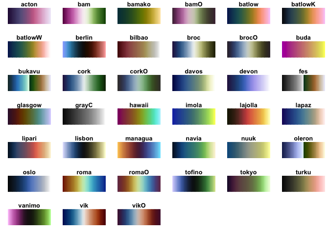
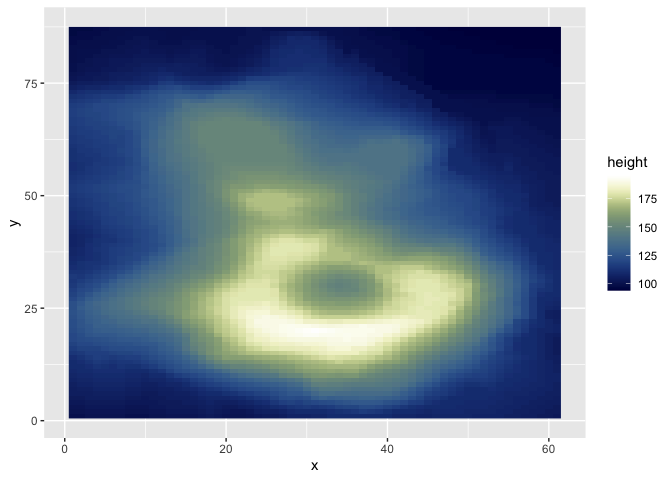

<!-- README.md is generated from README.Rmd. Please edit that file -->

# scico 

<!-- badges: start -->

[](https://github.com/thomasp85/scico/actions/workflows/R-CMD-check.yaml)
[](https://CRAN.R-project.org/package=scico)
[](https://app.codecov.io/gh/thomasp85/scico?branch=main)
<!-- badges: end --> This is a small package to provide access to the
colour palettes developed by Fabio Crameri and published at
<http://www.fabiocrameri.ch/colourmaps.php>. It uses more or less the
same api as [`viridis`](https://github.com/sjmgarnier/viridis) and
provides scales for [`ggplot2`](https://github.com/tidyverse/ggplot2)
without requiring `ggplot2` to be installed.

## Installation

`scico` can be installed from CRAN with `install.packages('scico')`. If
you want the development version then install directly from GitHub:

``` r
# install.packages("devtools")
devtools::install_github("thomasp85/scico")
```

## Palettes

`scico` provides 39 different palettes, all of which are perceptually
uniform and colourblind safe. There are 21 sequential palettes that also
include discrete and categorical variants. An additional 3
multi-sequential gradients, 10 diverging gradients, and 5 cyclic
gradients are also included. Those palettes also include discrete
variants but only the sequential types include categorical.An overview
can be had with the `scico_palette_show()` function:

``` r
library(scico)
scico_palette_show()
```

<!-- -->

Once you’ve decided on a palette you can generate colour values using
the `scico()` function:

``` r
scico(30, palette = 'lapaz')
#>  [1] "#190C64" "#1C176B" "#202272" "#212B79" "#243580" "#263D86" "#29478B"
#>  [8] "#2C5091" "#2F5996" "#33619A" "#37699D" "#3D71A0" "#4479A1" "#4D81A2"
#> [15] "#5688A4" "#608EA2" "#6B94A1" "#77999F" "#839E9C" "#90A198" "#9BA495"
#> [22] "#A9A895" "#B7AD96" "#C7B59C" "#D7BEA6" "#E5C9B3" "#F0D4C3" "#F7DFD3"
#> [29] "#FCE9E3" "#FEF2F2"
```

## ggplot2 support

`scico` provides relevant scales for use with `ggplot2`. It only
suggests `ggplot2` in order to stay lightweight, but if `ggplot2` is
available you’ll have access to the `scale_[colour|fill]_scico()`
functions:

``` r
library(ggplot2)
volcano <- data.frame(
  x = rep(seq_len(ncol(volcano)), each = nrow(volcano)),
  y = rep(seq_len(nrow(volcano)), ncol(volcano)),
  height = as.vector(volcano)
)
ggplot(volcano, aes(x = x, y = y, fill = height)) +
  geom_raster() +
  scale_fill_scico(palette = 'davos')
```

<!-- -->

## References

- Crameri, Fabio. (2023, June 14). *Scientific colour maps (Version
  8.0)* Zenodo. doi: 10.5281/zenodo.8035877
- Crameri, Fabio. (2018, May 8). *Scientific colour maps (Version
  3.0.1)*. Zenodo. doi: 10.5281/zenodo.1243909
- Crameri, Fabio. (2018). *Geodynamic diagnostics, scientific
  visualisation and StagLab 3.0*. Geosci. Model Dev. Discuss. doi:
  10.5194/gmd-2017-328
